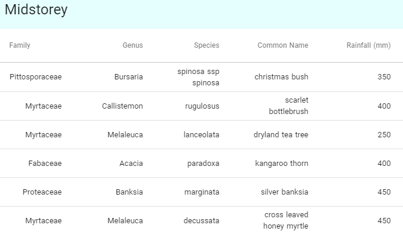
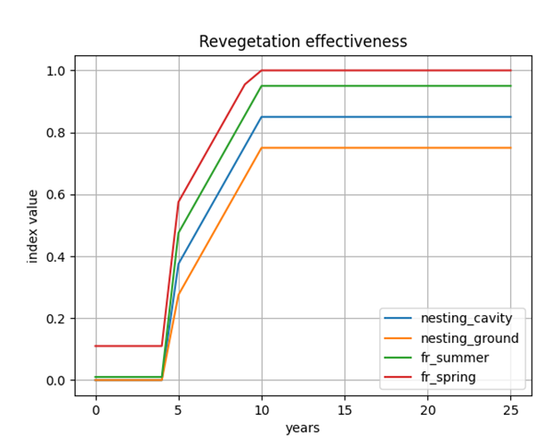
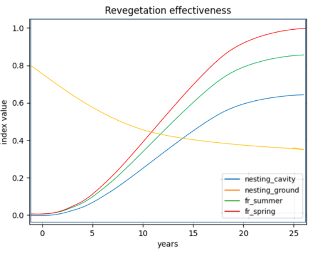

This document is the expert opinion of the scientists on the team. The
programmers have simply encoded this knowledge. The project lead is [Katja
Hogendoorn](https://www.adelaide.edu.au/directory/katja.hogendoorn). **DO NOT**
give too much weight to this curve, it is the best we have right now but will
be ground-truthed in time.

From the drop down menu on the Pollin8 page there is a section about the
science that has a generalised accumulation curve for the response variables
listed (see below). I have tweaked it from what I know about the life history
traits of the plants that would come up in a simple scenario from the plant
selection tool. Please feel free to amend if you think the logic is flawed. I
think a more generalised version of the traits I have listed below should be
used as some of the assumptions for generating Polin8 output.

# Revegetation resource accumulation curve (AKA the original curve)

Plant form (e.g. understorey, midstorey and overstorey), flowering onset and
flowing abundance are important factors for the provision of pollinator
resources so understanding the trade-offs between these factors is important
for planning the best mix of species for a site.

For example, overstorey species will produce the greatest amount of habitat and
flowering per plant and will therefore have the greatest effect on crop
pollinators however, overstorey plants may not be reproductive (e.g. producing
flowers) for 6-10 years and possibly won’t produce nesting cavities for 20
years.

Mid story shrub layers will establish nesting and flowering resources within
1-2 years although planting them too closely will cause competition between
plants reducing the overall fitness along with decreasing available ground
nesting bee habitat.

Understory species have the ability to produce resources very quickly however
they are small, and due to their often short lifespans might require seasonal
replanting. Selecting a diverse mix of plant species and forms that are suited
to the site is the most likely way of ensuring a sustainable revegetation
project. How would this look for a worked example from the plant selector.

# Tweaking the curve with the plant traits

I used a simple scenario from the selector **a Hedge row in southern Lofties
Apple region** chosen without any additional planting attributes. The top 6 sp
contender’s for direct seed that could be applied to bare ground at ca 1500
plants /hectare are below.

# The following plant traits of these contender species would impact on a revised curve as follows

- The Bursaria and Banksia Callistemon and Melaleuca lifespan is greater than
  80 years

- Acacia lifespan less than 20 years and it would become coarse woody debris
  within this time that impacts both available ground and cavities for these
  nesting syndromes

- All plants become reproductive eg flowering within 3 years

- Plants are selected for optimum pollen and nectar resources

- Banksia and Melaleuca decusatta are autumn-through to spring flowering and
  the others are spring summer flowering. Less summer flowering species means
  that the curve for this variable would lie below the spring flowering curve

- As the reveg matures less bare ground is available up until a point where
  it is self-recruiting and weeds and bare ground hit a balance

- Available nesting cavities of plants if suitable for bees in that guild
  would be slow to accumulate

# Initial curve

# Revised curve

